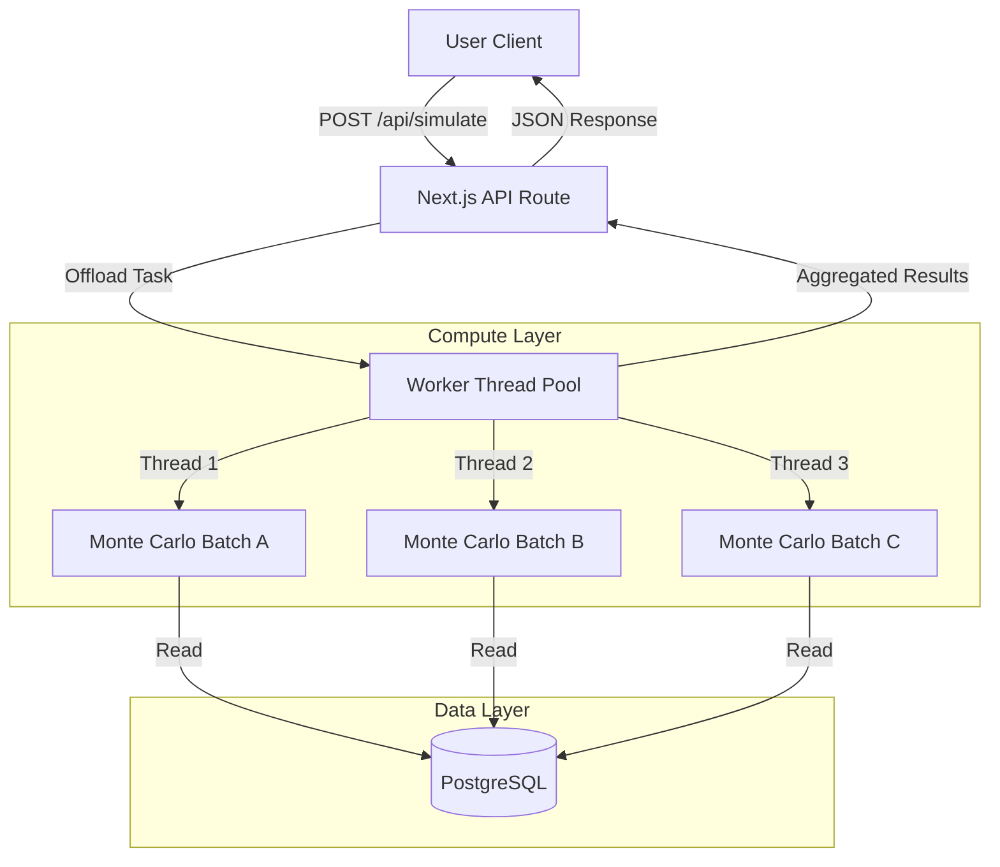

# RetirePlan | High-Performance Financial Simulation Engine


**RetirePlan** is a full-stack financial modeling platform designed to run computationally intensive **Monte Carlo simulations** for long-term wealth projection. Unlike standard deterministic calculators, this engine models market volatility, inflation variance, and sequence-of-returns risk using a parallelized compute layer.

The system decouples the computation logic from the web server using **Node.js Worker Threads**, allowing it to execute thousands of concurrent simulation years without blocking the API event loop.

## 🏗 System Architecture

The application uses a **Task Queue Architecture** to handle heavy compute loads. Requests are ingested via Next.js API routes and offloaded to a worker pool.



## 🚀 Key Technical Features

### 1. Multi-Threaded Compute Engine
Financial simulations (especially Monte Carlo) are CPU-bound. Running them on the main Node.js thread would starve the API.
* **Implementation:** Utilized `worker_threads` and `p-limit` to constrain concurrency.
* **Performance:** Capable of processing 100+ concurrent simulation requests (each running 1,000+ market iterations) with sub-second latency.
* **Isolation:** Each simulation runs in an isolated context, preventing memory leaks from crashing the main server.

### 2. Complex Relational Data Modeling (Prisma)
The financial model requires handling deep dependency trees, including progressive tax brackets, glide paths, and RMD (Required Minimum Distribution) schedules.
* **Schema Design:** utilized polymorphic relationships to handle `IncomeEvents`, `ExpenseEvents`, and `InvestEvents` under a unified `EventSeries` model.
* **Type Safety:** End-to-end type safety from the database (Prisma) to the frontend (TypeScript), ensuring integrity for financial calculations.

### 3. Custom YAML Serialization Protocol
To support data portability and version control for financial plans, I engineered a custom serialization engine.
* **Function:** Converts deeply nested relational database rows into flat, human-readable YAML files.
* **Recursive Parsing:** Automatically resolves relationships (e.g., `Event` -> `AssetAllocation` -> `TaxStatus`) during import/export.
* **Validation:** Custom middleware ensures imported YAML scenarios strictly adhere to the simulation engine's constraints before hitting the database.

## 🛠 Tech Stack

* **Frontend:** Next.js 14 (App Router), React, Tailwind CSS, Framer Motion
* **Backend:** Node.js API Routes, Worker Threads
* **Database:** PostgreSQL, Prisma ORM
* **Utilities:** `yaml`, `p-limit`, `chart.js`

## 💻 Local Development Setup

1. **Clone the repository**
   ```bash
   git clone https://github.com/Shameed4/FinancialPlanner.git
   cd FinancialPlanner
   ```

2. **Install dependencies**
   ```bash
   npm install
   ```

3. **Database Setup**
   Ensure you have a PostgreSQL instance running. Rename `.env.example` to `.env` and update `DATABASE_URL`.
   ```bash
   npx prisma generate
   npx prisma db push
   # Seed default tax brackets and RMD tables
   node prisma/seed.js
   ```

4. **Run the Development Server**
   ```bash
   npm run dev
   ```
   The application will handle compute offloading automatically based on your CPU core count.

## 📂 Project Structure

```text
├── app/
│   ├── api/             # API Routes (Simulate, Export, CRUD)
│   ├── algorithm/       # Core Monte Carlo logic & Worker handlers
│   └── scenario/        # UI Components for Scenario Building
├── prisma/
│   ├── schema.prisma    # Database Models (Tax, Events, Users)
│   └── seed.js          # Tax Bracket & RMD Seeding
├── utils/
│   └── scenarioConverter.ts # Custom JSON <-> YAML Parser
└── public/
```
